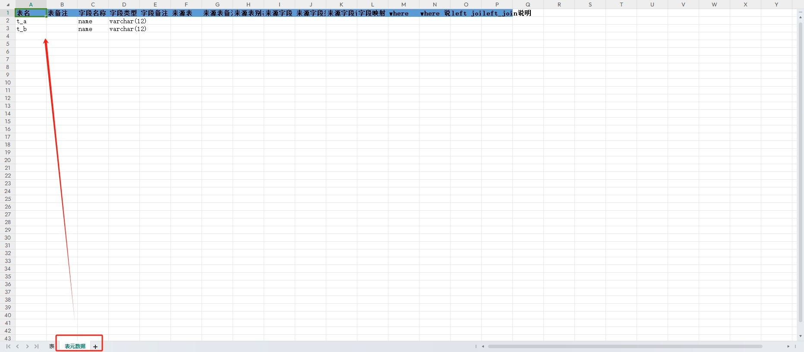

A common utils to use 

# db utils

## table info export to excel 

```python
from easybd.db import Mysql
mysql = Mysql("192.168.3.204", "3306", "root", "Mysql@2023", "cs", ["t_a", "t_b"])
mysql.table_info_to_excel("demo.xlsx")

```
<p align="center">


</p>


